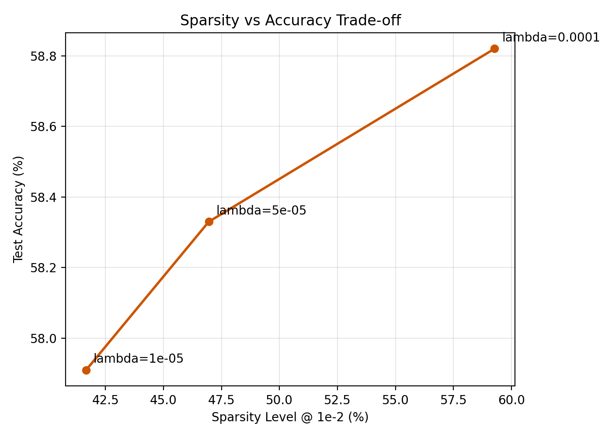
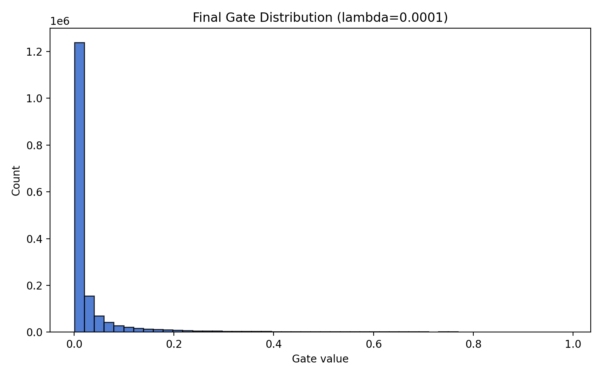

# Self-Pruning Neural Network Report

## Overview

This project implements a feed-forward neural network for CIFAR-10 using custom `PrunableLinear` layers. Each weight has a matching learnable `gate_scores` parameter. During the forward pass, the gate score is transformed with a sigmoid and multiplied element-wise with the weight:

```text
gates = sigmoid(gate_scores)
pruned_weights = weight * gates
```

The model is trained with:

```text
Total Loss = CrossEntropyLoss + lambda_eff * sum(sigmoid(gate_scores))
```

A short warmup period is used before gradually ramping `lambda_eff` to the target lambda. This keeps the required loss formulation while making optimization more stable.

## Why L1 on Sigmoid Gates Encourages Sparsity

The sigmoid converts each gate score into a value between `0` and `1`. A gate close to `0` effectively turns off its corresponding weight, while a gate close to `1` keeps the weight active. Adding the L1 norm of all gate values penalizes the model for keeping too many gates open. As lambda increases, the optimizer is encouraged to push more gates toward `0`, leaving a sparse network of the most useful connections.

## Results

Sparsity level is measured as the percentage of gates below the official pruning threshold `1e-2`.

| Lambda | Test Accuracy (%) | Sparsity Level (%) |
| --- | ---: | ---: |
| `1e-5` | `57.91` | `41.67` |
| `5e-5` | `58.33` | `46.95` |
| `1e-4` | `58.82` | `59.27` |

## Deployment-Style Metrics

The model has `1,706,496` gated weights. Treating gates below `1e-2` as pruned gives the following effective compression view:

| Lambda | Active Gated Weights | Pruned Gated Weights | Effective Compression |
| --- | ---: | ---: | ---: |
| `1e-5` | `995,404` | `711,092` | `1.71x` |
| `5e-5` | `905,221` | `801,275` | `1.89x` |
| `1e-4` | `695,063` | `1,011,433` | `2.46x` |

## Analysis

The results show that the network successfully learns to prune itself. Increasing lambda strengthens the sparsity penalty, which increases the percentage of gates pushed below the pruning threshold. Sparsity rises from `41.67%` at `lambda = 1e-5` to `59.27%` at `lambda = 1e-4`.

The best model in this run is `lambda = 1e-4`, which achieves the highest test accuracy (`58.82%`) and the highest sparsity level (`59.27%`). This indicates that the model can remove a substantial fraction of its weights while preserving classification performance.

The gradient-flow check in the source code verifies that gradients reach both `weight` and `gate_scores`, confirming that the model can learn normal weights and pruning gates together.

## Sparsity vs Accuracy

The plot below shows that increasing lambda improves sparsity without collapsing accuracy.



## Gate Distribution

The plot below shows the final gate-value distribution for the best model (`lambda = 1e-4`). A large concentration near `0` indicates many pruned connections, while gates away from `0` represent connections retained for classification.


